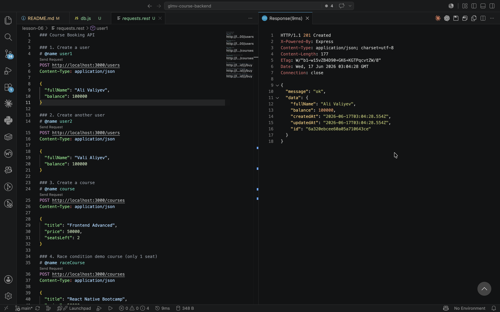
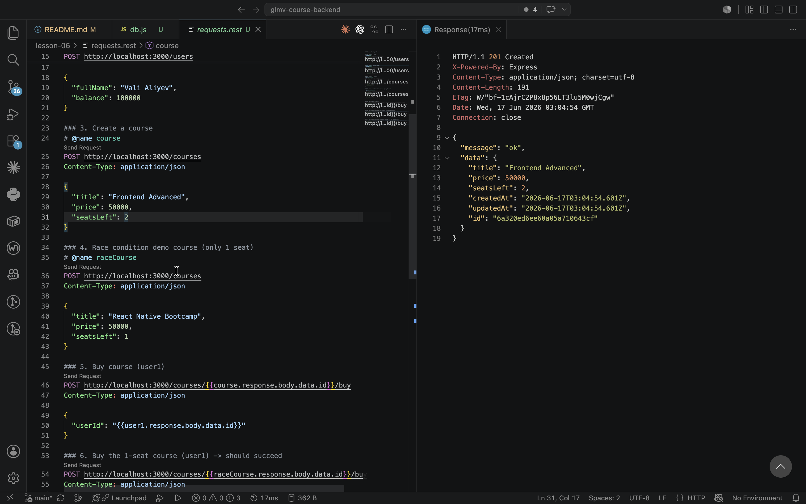
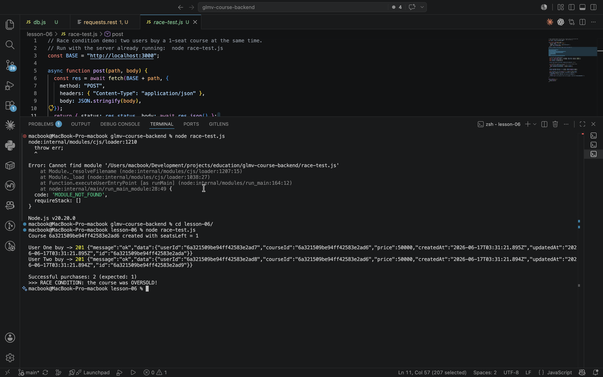
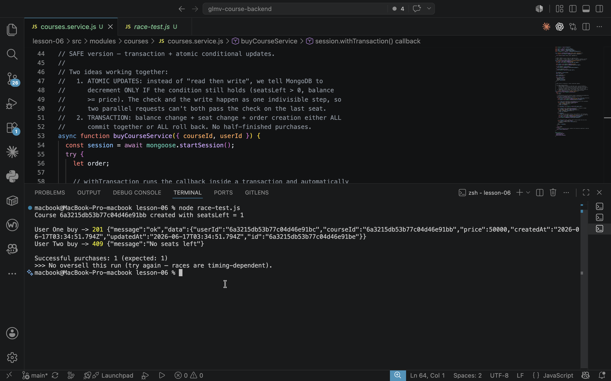

# Course Booking API

A small Node.js + Express + MongoDB + Mongoose backend where users can buy
limited-seat courses. The goal of this lesson is to build a course-purchase
endpoint, **reproduce a race condition**, and then **fix it with a MongoDB
transaction + atomic updates**.

## Tech stack

- Node.js + Express
- MongoDB (run as a **single-node replica set** — required for transactions)
- Mongoose

## The race condition

Create one course with a single seat and two users with enough balance, then
send **two buy requests at the same time**.

- **Expected:** only one user succeeds; the other gets `{ "message": "No seats left" }`.
- **Bug:** both users succeed — the course is oversold.

Run the included script (fires both buys in parallel with `Promise.all`):

```bash
node race-test.js
```

### Before the fix — oversold ❌

The simple "read → check → write" version lets both requests read
`seatsLeft = 1` before either writes `0`, so both succeed.

### After the fix — race-safe ✅

`buyCourseService` wraps the purchase in a **transaction** and uses **atomic
conditional updates** (`findOneAndUpdate` with `seatsLeft: { $gt: 0 }` and
`balance: { $gte: price }`). Now only one user can take the last seat; the
other gets `No seats left`.

## Why the fix works

1. **Atomic updates** — the check and the write happen as one indivisible
   database operation, so two parallel requests can't both pass the check on
   the last seat.
2. **Transaction** — the balance change, seat change, and order creation all
   commit together or all roll back, so there are no half-finished purchases.

Transactions only work on a replica set, which is why MongoDB is started with
`--replSet`.

## Screenshots

**Create a user — `POST /users`**



**Create a course — `POST /courses`**



**Before the fix — course oversold ❌ (2 successful purchases)**



**After the fix — race-safe ✅ (1 purchase, the other gets "No seats left")**


